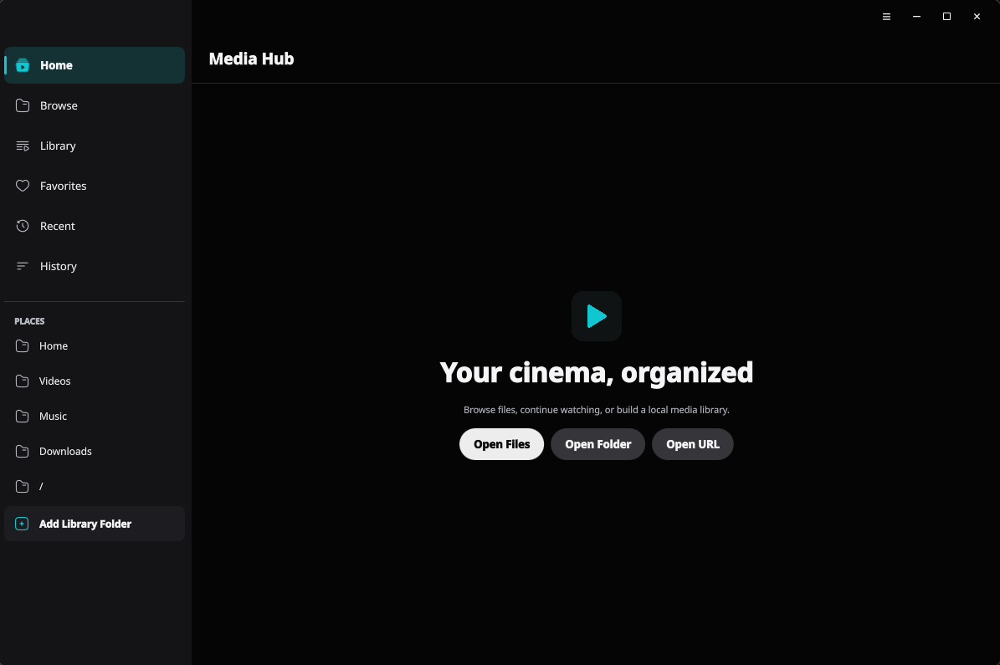
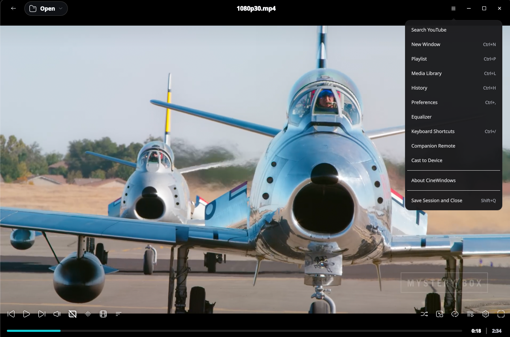
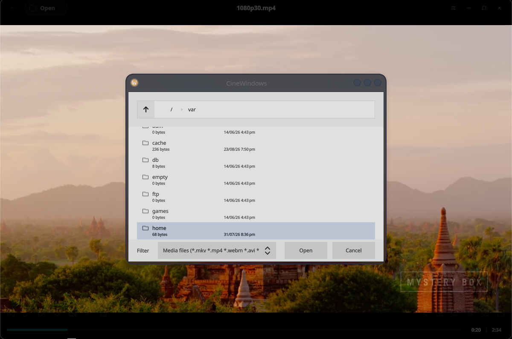
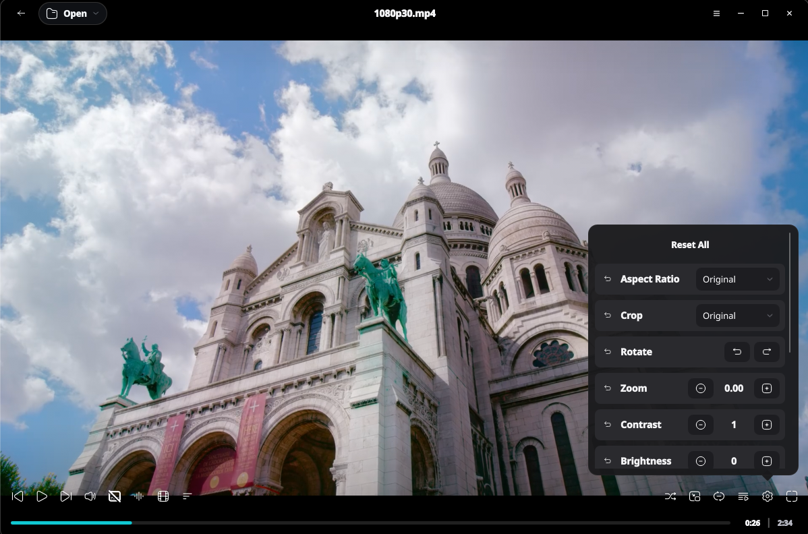
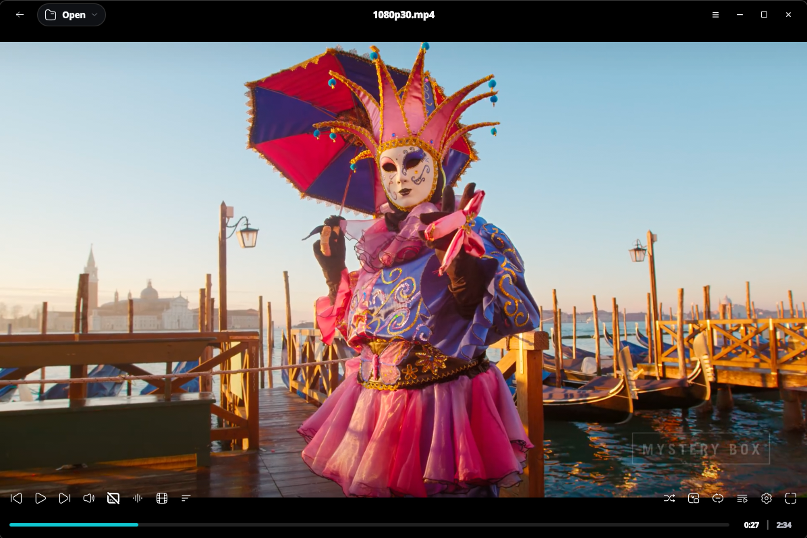

<div align="center">


# CineWindows

**A modern, high-performance desktop media player built with Qt 6, QML, C++20, and libmpv.**

[](https://cinewindows.vercel.app)
[](https://github.com/Riteshp2001/CineWindows/releases)
[-orange?style=flat-square)](LICENSE.md)
[](https://github.com/Riteshp2001/CineWindows/releases)

CineWindows delivers a polished, native viewing experience with hardware-accelerated video playback, extensive format support via FFmpeg, and deep integration with the mpv ecosystem — all wrapped in a sleek, frameless dark-theme UI.

> **License:** [CineWindows Community License](LICENSE.md) — Source-available. Personal, non-commercial use only.
>
> **Copyright © 2026 Ritesh Pandit. All rights reserved.**

</div>

---

## ✨ Screenshots

<div align="center">

| Home / Media Hub | Fullscreen Playback |
|:---:|:---:|
|  |  |

| Playback with Controls | Adjustment Settings Panel |
|:---:|:---:|
|  |  |



*CineWindows — distraction-free, high-fidelity playback on every platform.*

</div>

---

## 🚀 Features

### 🎬 Core Playback

| Feature | Status |
|---------|--------|
| Video playback (all FFmpeg formats) | ✅ |
| Audio playback | ✅ |
| Hardware decoding (DXVA2, D3D11VA, etc.) | ✅ Configurable |
| yt-dlp streaming (YouTube, etc.) | ✅ Built-in |
| Playlist management (M3U/M3U8) | ✅ |
| Chapter navigation | ✅ |
| A-B loop, file/playlist loop | ✅ |
| Speed control (0.25x–4.0x) | ✅ |
| Frame stepping | ✅ |
| Subtitle support (SRT, ASS, SSA, VTT, etc.) | ✅ Auto-load + manual |

### 🎛️ Control & Integration

| Feature | Description |
|---------|-------------|
| 🖥️ **JSON-RPC IPC Server** | Opt-in TCP server on `127.0.0.1` speaking the mpv JSON IPC protocol. Start it with `--ipc-server=<port>`. |
| 💻 **CLI Mode** | Launch with `--cli` to get an interactive command-line interface (stdin/stdout JSON-RPC). |
| ⌨️ **Remappable Shortcuts** | Every key binding is user-configurable via the Preferences dialog or `input.conf`. |
| 🖱️ **Mouse Controls** | Click/pause, double-click fullscreen, scroll volume, horizontal scroll seek. |
| 🎨 **Video Filters** | Contrast, brightness, gamma, saturation, hue, zoom, pan, aspect ratio, deinterlace, deband. |
| 📸 **Screenshots** | With subs, without subs, window capture, or every frame. |
| 📋 **Drag & Drop** | Drop media files, folders, or subtitle tracks directly onto the window. |

### 🖌️ User Interface

- **Frameless dark-themed window** with custom title bar and resize handles
- **On-screen display (OSD)** for volume, seek position, notifications
- **Media Hub home** with quick access to files, folders, URLs, and recent playback
- **Playlist drawer** with drag-to-reorder, shuffle, save/load
- **Preferences dialog** for all playback, subtitle, and UI settings
- **Multi-language support** (50+ translations via Qt Linguist)
- **Media Hub** with filesystem browsing, library indexing, favorites, recents, thumbnails, history, and local watch statistics
- **Light/dark palettes**, custom accent color, and reduced-motion support
- **Advanced playback** with equalizer presets, audio visualization, 3D conversion, HDR tone mapping, PiP, and mini-player modes
- **Optional integrations** for YouTube search, OpenSubtitles, DLNA casting, and a paired LAN companion remote

---

## 🛠️ Stack

| Layer | Technology |
|-------|-----------|
| Language | C++20, QML |
| Framework | Qt 6.8+ (Core, Gui, Qml, Quick, Network, Svg) |
| Video Backend | libmpv via KDE MpvQt 1.2.0 |
| Build System | CMake 3.25+ (Ninja) |
| Platform | Windows x86_64, macOS arm64/x86_64, Linux x86_64 (AppImage and Flatpak) |
| Streaming | yt-dlp |
| Packaging | Windows: NSIS installer + portable ZIP — macOS: .dmg — Linux: AppImage + Flatpak |

---

## 📁 Project Layout

```text
CineWindows/
├── src/
│   ├── app/              QSettings-backed application preferences
│   ├── models/           Playlist, track, and chapter list models
│   ├── player/           MpvQt wrapper, playback controller, IPC server,
│   │                     video options, input router, mpv config loader
│   ├── services/         File helpers, session restore, update checker
│   └── utils/            Media/path utility functions
├── qml/
│   ├── App.qml           Main application shell
│   ├── controls/         Transport controls, menus, buttons, popups
│   ├── dialogs/          URL, about, shortcut reference dialogs
│   ├── overlays/         OSD, toast, drop zone, chrome overlays
│   ├── library/          Media Hub, browsing, search, history, and idle home
│   ├── playlist/         Playlist side drawer
│   ├── preferences/      Settings panels
│   ├── style/            Design system (Theme.qml)
│   ├── utils/            Time formatting utility
│   └── window/           Frameless window resize handles
├── scripts/
│   ├── setup/            Platform dependency bootstrap scripts
│   ├── generate/         Translation and icon generation tools
│   └── package/          Deployment and package verification scripts
├── packaging/            Platform packaging metadata and artifact locations
├── resources/            Runtime, icon, remote, and platform resources
├── screenshots/          App screenshots for README and documentation
└── docs/                 Engineering plans and documentation index
```

---

## 🔧 Build

### Prerequisites

- **Qt 6.8+** (MinGW or MSVC) with these modules:
  - Core, Gui, Network, Qml, Quick, QuickControls2, QuickDialogs2, Svg
- **CMake 3.25+**
- **Ninja** (recommended) or Make
- **libmpv** development files (headers + import library)
- **MpvQt 1.2.0** (KDE wrapper library)

### Supported Platforms

| Platform | Architecture | CI | Release Package |
|----------|--------------|-----|-----------------|
| Windows | x86_64 (MinGW) | ✅ | Installer and portable ZIP |
| Linux | x86_64 | ✅ | AppImage and Flatpak bundle |
| macOS | arm64 | ✅ | DMG |
| macOS | x86_64 | ✅ | DMG |

> Other architectures are not currently packaged or claimed as supported.

Initialize the pinned source dependencies after cloning:

```bash
git submodule update --init --recursive
```

### Quick Start

#### 🪟 Windows

```powershell
# 1. Bootstrap standalone libmpv and MpvQt
& scripts\setup\bootstrap_libmpv_windows.ps1
& scripts\setup\bootstrap_mpvqt_windows.ps1

# 2. Configure & build
cmake --preset release
cmake --build --preset release

# 3. Run
.\build\release\bin\CineWindows.exe
```

#### 🐧 Linux (Debian/Ubuntu)

```bash
# 1. Install system dependencies
bash scripts/setup/bootstrap_linux.sh

# 2. Configure & build (MpvQt is fetched automatically)
cmake --preset release
cmake --build --preset release

# 3. Run
./build/release/CineWindows
```

#### 🍎 macOS

```bash
# 1. Install system dependencies
bash scripts/setup/bootstrap_macos.sh

# 2. Generate macOS icon bundle
bash scripts/generate/generate_icns.sh

# 3. Configure & build (MpvQt is fetched automatically)
cmake --preset release
cmake --build --preset release

# 4. Run
open ./build/release/CineWindows.app
```

### Options

```powershell
# Use the debug configuration for development
cmake --preset debug
cmake --build --preset debug

# Launch with CLI mode (stdin JSON-RPC)
.\build\release\bin\CineWindows.exe --cli

# Custom IPC port
.\build\release\bin\CineWindows.exe --ipc-server=32322

# Custom MpvQt install path
cmake --preset release -DMpvQt_DIR=C:\path\to\MpvQt\lib\cmake\MpvQt
```

### 🔍 Diagnostic Logs

All Qt, QML, player, library, and service diagnostics are routed through the pinned QtLogger backend. CineWindows writes `cinewindows.log` under the platform application-data directory. Concurrent instances use separate reusable slots (`cinewindows-2.log`, `cinewindows-3.log`, etc.) without waiting for another player's log file. Each slot keeps up to five 5 MiB files and compresses rotated files.

Set `CINEWINDOWS_DATA_DIR` to place application data and logs under a custom root. No HTTP logging sink is enabled.

In **Preferences › Diagnostics**, **Export Logs** saves a UTF-8 text report with the current system snapshot. **Logs Folder** opens the directory containing active and rotated logs for all instances. Exported reports redact URL credentials, query strings, and common token fields — review before sharing.

---

## 📦 Packaging

### 🪟 Windows

```powershell
& scripts\setup\bootstrap_libmpv_windows.ps1
& scripts\setup\bootstrap_media_tools_windows.ps1
& scripts\package\deploy_windows.ps1 -Configuration Release
```

Produces:
- 📦 Portable ZIP → `packaging/windows/artifacts/`
- 📀 NSIS Installer → `packaging/windows/artifacts/` (when `makensis` is available)

### 🐧 Linux (AppImage)

```bash
bash scripts/package/deploy_linux.sh "build/release" "packaging/linux/artifacts"
```

Produces:
- 📦 `CineWindows-x86_64.AppImage` → `packaging/linux/artifacts/`

### 🐧 Linux (Flatpak)

```bash
bash scripts/package/deploy_flatpak.sh
```

Produces:
- `CineWindows-x86_64.flatpak` → `packaging/flatpak/artifacts/`

### 🍎 macOS (DMG)

```bash
bash scripts/generate/generate_icns.sh
bash scripts/package/deploy_macos.sh "build/release" "packaging/macos/artifacts" "$(uname -m)"
```

Produces:
- `CineWindows-arm64.dmg` or `CineWindows-x86_64.dmg` → `packaging/macos/artifacts/`

---

## 🌐 IPC Protocol

CineWindows implements the **mpv JSON IPC protocol** over opt-in TCP on `127.0.0.1`. Start it with `--ipc-server=32321`.

```bash
# Get current playback position
echo '{"command":["get_property","time-pos"],"request_id":1}' | nc -q0 127.0.0.1 32321

# Toggle pause
echo '{"command":["set","pause",true],"request_id":2}' | nc -q0 127.0.0.1 32321

# Load a file
echo '{"command":["loadfile","C:\\Movies\\clip.mp4","replace"],"request_id":3}' | nc -q0 127.0.0.1 32321

# Observe property changes
echo '{"command":["observe_property",1,"time-pos"],"request_id":4}' | nc -q0 127.0.0.1 32321
```

Responses and events are newline-delimited JSON. Property changes are automatically broadcast to connected clients.

---

## ⌨️ Keyboard Shortcuts

All shortcuts are **fully remappable** via `Preferences → Shortcuts` or by editing key bindings directly.

| Category | Shortcuts |
|----------|-----------|
| **Playback** | `Space` (play/pause), `S` (screenshot) |
| **Seek** | `←` / `→` (5s), `Shift+←/→` (60s), `Ctrl+←/→` (600s) |
| **Volume** | `↑` / `↓`, `9` / `0` |
| **Speed** | `[` / `]` (0.1x steps), `{` / `}` (0.5x steps) |
| **Subtitles** | `V` (toggle), `J` (cycle), `G`/`H` (delay), `R`/`T` (position) |
| **Video** | `Z` (zoom), `A` (aspect ratio), `D` (deband), `Ctrl+Z` (pan/zoom reset) |
| **Playlist** | `N`/`P` (next/previous), `Del` (remove), `F1` (toggle drawer) |
| **Window** | `F11` (fullscreen), `Ctrl+Q` (quit), `Ctrl+W` (close) |
| **Stats** | `I` (stats page), `Shift+1-5` (direct page), `Ctrl+I` (overlay) |

---

## ⚙️ CI/CD

| Workflow | Platform | Trigger | Artifacts |
|----------|----------|---------|-----------| 
| **CI** | Windows, Linux, macOS | Push/PR to main | Native and Flatpak builds |
| **Release** | Windows | Tag `v*` | NSIS installer + portable ZIP |
| **Release** | Linux | Tag `v*` | AppImage + Flatpak bundle |
| **Release** | macOS arm64 + x86_64 | Tag `v*` | Architecture-specific DMGs |

### 📚 Dependencies

| Library | Purpose |
|---------|---------|
| [mpv](https://mpv.io/) | Video player library powering playback |
| [MpvQt](https://github.com/KDE/mpvqt) | KDE Qt bindings for libmpv |
| [yt-dlp](https://github.com/yt-dlp/yt-dlp) | Streaming support |
| [FFmpeg](https://ffmpeg.org/) | Media decoding |
| [RinUI](https://github.com/RinLit-233-shiroko/Rin-UI) | Pinned design reference (not used at runtime) |

---

## 🤝 Community & Project Policies

| Document | Link |
|----------|------|
| Contributing Guide | [CONTRIBUTING.md](CONTRIBUTING.md) |
| Code of Conduct | [CODE_OF_CONDUCT.md](CODE_OF_CONDUCT.md) |
| Support | [SUPPORT.md](SUPPORT.md) |
| Security Policy | [SECURITY.md](SECURITY.md) |
| Governance | [GOVERNANCE.md](GOVERNANCE.md) |
| Maintainers | [MAINTAINERS.md](MAINTAINERS.md) |
| Authors & Contributors | [AUTHORS.md](AUTHORS.md) · [CONTRIBUTORS.md](CONTRIBUTORS.md) |
| Citation | [CITATION.cff](CITATION.cff) |
| Privacy & License | [PRIVACY.md](PRIVACY.md) · [LICENSE.md](LICENSE.md) · [THIRD_PARTY_NOTICES.md](THIRD_PARTY_NOTICES.md) |
| Release History | [Releases](https://github.com/Riteshp2001/CineWindows/releases) |

---

<div align="center">

*Built with ❤️ by [Ritesh Pandit](https://riteshdpandit.vercel.app) · Source available on [GitHub](https://github.com/Riteshp2001/CineWindows)*

</div>
